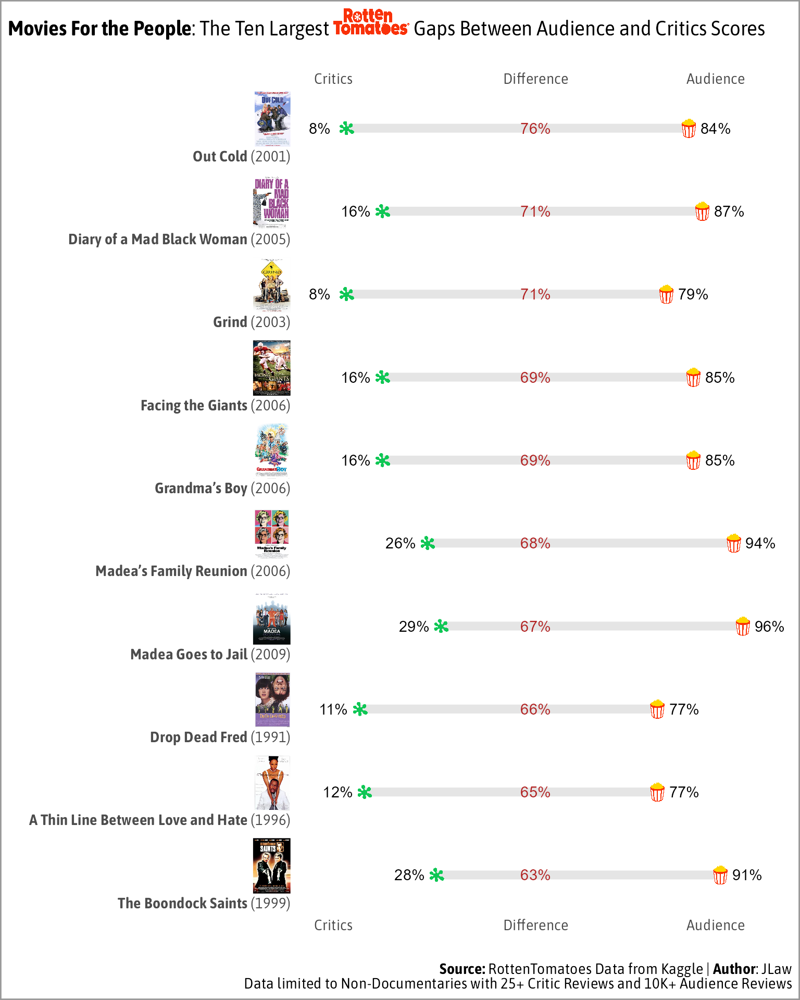

JLaw’s Data Visualizations
================

In addition to my [blog](https://jlaw.netlify.app), I occasionally try
to make random data visualizations for this that happen to pop into my
mind. Inspired by [z3tt’s TidyTuesday
repo](https://github.com/Z3tt/TidyTuesday). I decided to make a repo for
myself.

## 2023/11/05 - Longest Stanley Cup Droughts (1917-2023)

## 2023/10/20 - Movies For The Critics

## 2023/10/19 - Movies For The People

## 2023/10/01 - The Most Unexpectedly Good and Bad Episodes of TV

## 2021/12/29 - The Chaos of College Football Realignment

## 2021/10/03 - What is the “Most American Movie” Ever Made?

## 2021/09/06 - Which MTV The Challenge Cast Has Appeared Most Often and When

## 2021/08/27 - WWF/E Triple Crown Champions

## 2021/05/16 - Comparing 1998 and 2007 AFI Top 100 Lists

